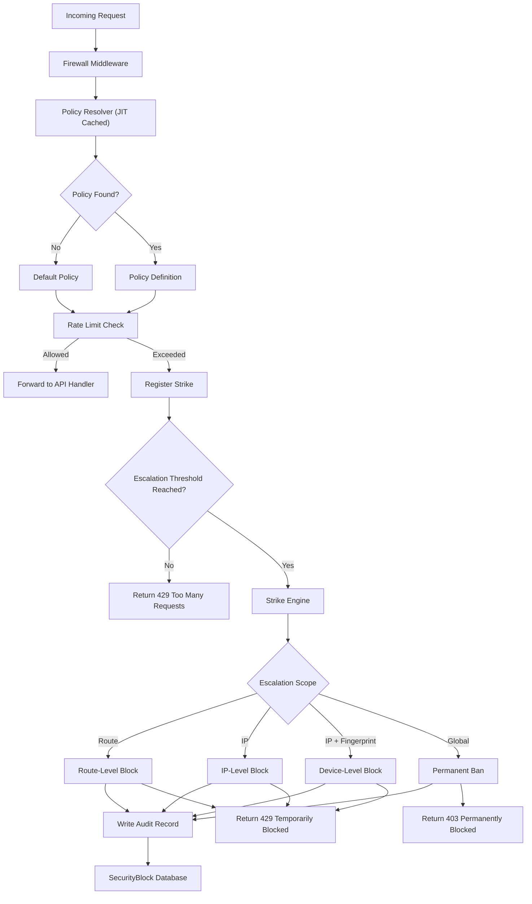

# Forkit Security & Firewall Module

This module implements a policy-driven, audit-ready security and rate-limiting system for the Forkit backend, built on FastAPI.

It provides a global request governor with:
- Policy-based rate limiting
- Escalation ladders (route → IP → IP + fingerprint → global)
- Temporary and permanent blocking
- Database-backed audit trails
- Version-agnostic enforcement (v1, v2, v3, …)
- Extensible security policies

---

## Architecture Flow



---

## Directory Structure

```text
security/
├── config.py
├── policies/
│   ├── enums.py
│   ├── definitions.py
│   ├── domains.py
│   ├── resolver.py
│   └── cache.py
└── firewall/
    ├── middleware.py
    ├── rate_limit.py
    ├── strikes.py
    ├── strike_engine.py
    ├── blacklist.py
    ├── ip_rules.py
    ├── exceptions.py
    └── utils.py

```

---

## Core Concepts

### Policy Driven Security
All rate limits, escalation thresholds, scopes, and fingerprint requirements are defined in policy definitions.  
Routes never hardcode limits.

### Escalation Scopes
| Scope | Description |
|------|-------------|
| ROUTE | Single endpoint |
| IP | Entire client IP |
| IP_FINGERPRINT | IP + device/browser fingerprint |
| GLOBAL | Permanent global ban |

### Audit & Persistence
All security events are stored in a portable SQL schema supporting:
- Temporary blocks with expiry
- Permanent bans
- Soft delete (revocation)
- Policy attribution
- Forensic analysis

---

## Extending

### Add New Policy
1. Add enum in `policies/enums.py`
2. Define limits in `policies/definitions.py`
3. Map domain in `policies/domains.py`

### Add New Escalation Scope
Extend:
- `strike_engine.py`
- `blacklist.py`
---

## Database Compatibility

Designed for:
- SQLite (dev)
- PostgreSQL (prod)
- MySQL / MariaDB

No vendor-locked features are used.

*However, as of this writing, neither the main nor the security database modules will be made public.*

---

## License

This module is designed to be extracted as a standalone open-source FastAPI security framework.
