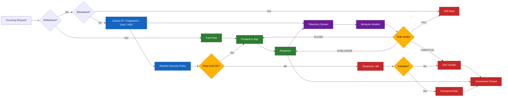

# Forkit Security & Adaptive Firewall

### Cerberus-Integrated Zero-Trust Enforcement Layer

This repository contains the **open-source security and firewall layer** of the Forkit backend.
It demonstrates how a **production-grade, zero-trust perimeter** can be built using composable, auditable, and deterministic enforcement modules, while seamlessly integrating with an adaptive intelligence engine.

The design separates concerns clearly:

* **Deterministic Firewall Core** - policy resolution, rate-limiting, escalation, and hard enforcement
* **Cerberus Intelligence Interface** - behavioral telemetry, risk scoring contracts, and response orchestration
* **Application Isolation** - security decisions are finalized before any request reaches business logic

> 🔒 **Cerberus Disclosure Policy**

This repository intentionally exposes only the **control flow, enforcement pipeline, and interface contracts** of Cerberus.
The internal behavioral models, heuristics, and detection algorithms remain **closed and proprietary**.

This approach ensures:

* Full auditability of security enforcement
* Reproducible integration patterns for adaptive defenses
* Zero leakage of sensitive detection logic
* A clean separation between **policy execution** and **threat intelligence**

In short:
You get a complete, real-world firewall architecture - without compromising the core of the AI that powers it.

## Components

### 1. Policy Firewall (Deterministic Layer)

The firewall is a rule-driven enforcement system responsible for:

- Route-aware rate limiting
- Escalation ladders (Route → IP → IP+Fingerprint → Global)
- Temporary and permanent blocks
- Database-backed audit trails
- Cache-first enforcement with async persistence
- Zero trust defaults for sensitive routes (AUTH, OTP, ADMIN, etc.)

This layer guarantees protection even when no behavior pattern exists (e.g., raw request floods, credential stuffing, scraping, etc.).

It answers the question:

> “Is this client violating declared security policy limits?”

If yes, it blocks immediately and records the action.

---

### 2. Cerberus (Adaptive Threat Brain)

Cerberus is an **out-of-band behavioral intelligence engine** that runs in parallel to the firewall.

It does **not** replace policies.  
It **augments** them.

Its role is to:

- Observe request telemetry (rate, errors, latency, patterns)
- Build adaptive baselines per identity (IP, fingerprint, user)
- Accumulate behavioral risk over time
- Classify threat state progression (NORMAL → WATCH → CHALLENGE → RESTRICT → TERMINATE)
- Issue high-level decisions to the firewall:
  - ALLOW
  - CHALLENGE
  - THROTTLE
  - KILL (autonomous permanent ban)

Cerberus answers a different question:

> “Is this client behaving like an evolving automated or hostile system, even if it is still under policy limits?”

This allows detection of:

- Low-and-slow credential probing
- Distributed bot swarms
- Adaptive scraping
- Attack pattern shaping
- Pre-rate-limit reconnaissance

It is **not** a replacement for the firewall.

## How They Work Together

### Dual-Layer Defense

Request → Firewall Policy Check → Cerberus Telemetry Feed → Cerberus Decision → Final Enforcement

### Responsibility Separation

| Layer | Purpose | Failsafe |
|------|---------|----------|
| Firewall | Hard limits, compliance, legal audit | Always blocks floods |
| Cerberus | Pattern intelligence, adaptive risk | Never sole line of defense |

Cerberus **never disables** policy limits.  
Firewall **never trusts** Cerberus blindly.

They are intentionally independent.

## Flowchart Overview

## Public vs Private Boundary

This repository intentionally contains:

- Policy framework
- Middleware wiring
- Escalation flow
- Persistence model
- Observability hooks

It intentionally does **not** contain:

- Risk scoring formulas
- Baseline adaptation math
- State transition models
- Threat classification weights
- Decision heuristics

Those remain in a closed-source research repository and are linked at runtime like a plug-in brain.

---

## Design Philosophy

1. Deterministic before probabilistic
2. Auditability over opacity
3. Fail closed, not open
4. Rules must remain enforceable even if intelligence degrades
5. Behavioral intelligence is additive, never the sole authority

---

## Open Source Goal

This project is published to demonstrate:

- Pluggable adaptive security architecture
- Safe integration of behavioral intelligence into critical paths
- Hybrid deterministic + adaptive defense models
- Explainable, legally auditable security systems suitable for regulated environments

### 👨‍💻 Developer Note

This repository focuses on **architecture, correctness, and safety of integration**, not on claiming to be an unbreakable security product.

The goal is to show how to:

* Structure a real firewall as clean, testable modules
* Isolate AI/ML systems behind strict enforcement contracts
* Design escalation paths that remain auditable and legally defensible
* Build security systems that fail safely under uncertainty

If you are studying security engineering, distributed systems, or AI-in-the-loop control systems, this codebase is meant to be read as an **engineering reference**, not a black-box solution.
