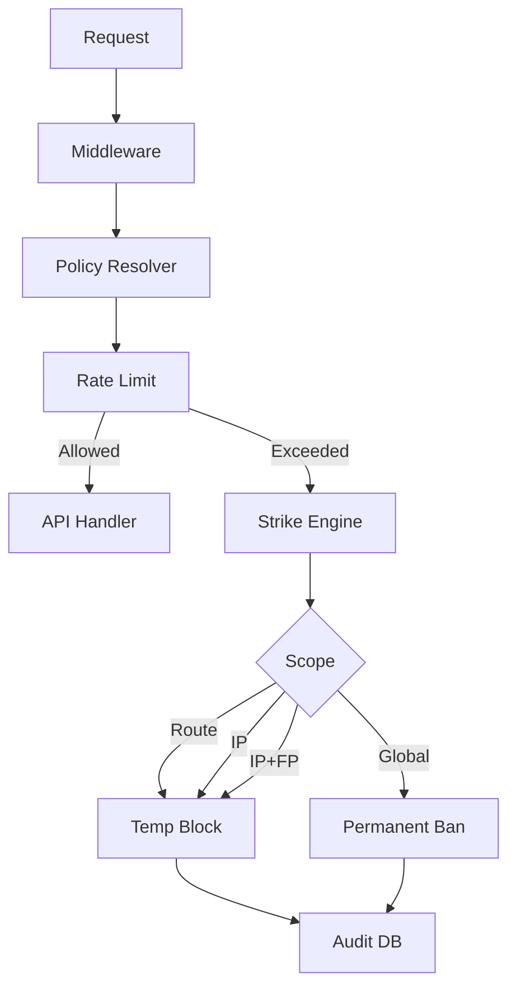

# Firewall Module

## Purpose
The Firewall module acts as the global request governor for the Forkit backend. It enforces rate limits, escalation, blocking, and audit logging for all incoming HTTP traffic.

## Flow

## Key Files
- middleware.py – Global FastAPI middleware
- rate_limit.py – Sliding window limiter
- strikes.py – In-memory strike counters
- strike_engine.py – Escalation logic
- blacklist.py – Active block lookup
