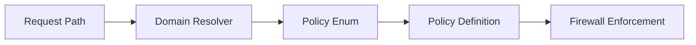

# Policies Module

## Purpose
Defines the security and rate-limit behavior of the system in a declarative manner.

## Structure

```text
policies/
├── enums.py        # Policy names
├── definitions.py # Limits, windows, escalation
├── domains.py     # Domain → Policy mapping
├── resolver.py    # URL → Domain classifier
└── cache.py       # JIT resolution cache
```

## Example Flow


